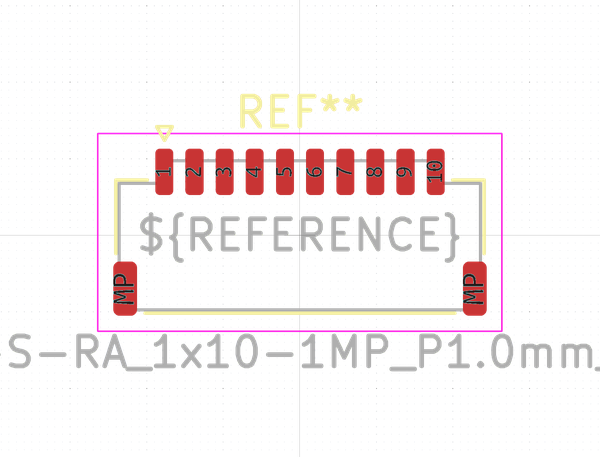

# OOMP Footprint  
##   by none  
  
oomp key: oomp_kicad_connector_samtec_micromate_samtec_t1m_10_x_s_ra_1x10_1mp_p1_0mm_terminal_horizontal  
  
source repo at: [http://gitlab.com/kicad/libraries/kicad-footprints//blob/master/tmp/libraries/kicad-footprints/Varistor.pretty/RV_Rect_V25S440P_L26.5mm_W8.2mm_P12.7mm.kicad_mod](http://gitlab.com/kicad/libraries/kicad-footprints//blob/master/tmp/libraries/kicad-footprints/Varistor.pretty/RV_Rect_V25S440P_L26.5mm_W8.2mm_P12.7mm.kicad_mod)  
## Footprint  
  
  
  
  
| name | value | 
| --- | --- | 
| footprint name |  | 
| footprint description |  | 
| number of pads |  | 
| github path | http://github.com/kicad/libraries/kicad-footprints//blob/master/tmp/libraries/kicad-footprints/Connector_Samtec_MicroMate.pretty/Samtec_T1M-10-X-S-RA_1x10-1MP_P1.0mm_Terminal_Horizontal.kicad_mod | 
| oomp key | oomp_kicad_connector_samtec_micromate_samtec_t1m_10_x_s_ra_1x10_1mp_p1_0mm_terminal_horizontal | 
| oomp bot github | https://github.com/oomlout/oomlout_oomp_footprint_bot/tree/main/footprints/kicad_connector_samtec_micromate_samtec_t1m_10_x_s_ra_1x10_1mp_p1_0mm_terminal_horizontal/working | 
## Images  
