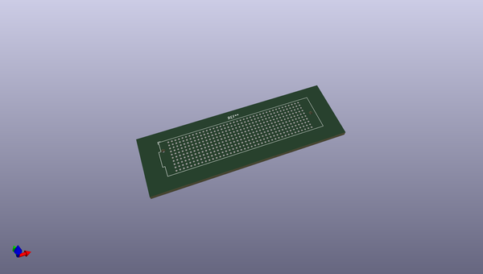
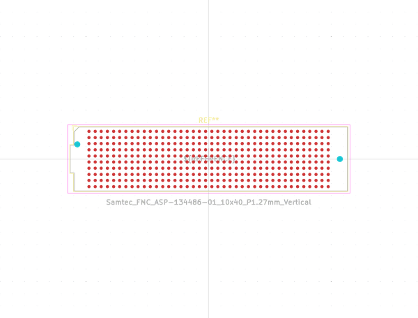

# OOMP Footprint  
## Samtec_FMC_ASP-134486-01_10x40_P1.27mm_Vertical  by none  
  
oomp key: oomp_kicad_connector_samtec_samtec_fmc_asp_134486_01_10x40_p1_27mm_vertical  
  
source repo at: [http://gitlab.com/kicad/libraries/kicad-footprints//blob/master/tmp/libraries/kicad-footprints/Varistor.pretty/RV_Rect_V25S440P_L26.5mm_W8.2mm_P12.7mm.kicad_mod](http://gitlab.com/kicad/libraries/kicad-footprints//blob/master/tmp/libraries/kicad-footprints/Varistor.pretty/RV_Rect_V25S440P_L26.5mm_W8.2mm_P12.7mm.kicad_mod)  
## Footprint  
  
  
  
  
| name | value | 
| --- | --- | 
| footprint name | Samtec_FMC_ASP-134486-01_10x40_P1.27mm_Vertical | 
| footprint description | http://suddendocs.samtec.com/prints/asp-134486-01-mkt.pdf | 
| number of pads | 402 | 
| github path | http://github.com/kicad/libraries/kicad-footprints//blob/master/tmp/libraries/kicad-footprints/Connector_Samtec.pretty/Samtec_FMC_ASP-134486-01_10x40_P1.27mm_Vertical.kicad_mod | 
| oomp key | oomp_kicad_connector_samtec_samtec_fmc_asp_134486_01_10x40_p1_27mm_vertical | 
| oomp bot github | https://github.com/oomlout/oomlout_oomp_footprint_bot/tree/main/footprints/kicad_connector_samtec_samtec_fmc_asp_134486_01_10x40_p1_27mm_vertical/working | 
## Images  
