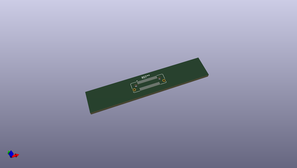
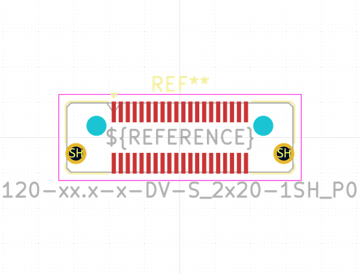

# OOMP Footprint  
## Samtec_LSHM-120-xx.x-x-DV-S_2x20-1SH_P0.50mm_Vertical  by none  
  
oomp key: oomp_kicad_connector_samtec_samtec_lshm_120_xx_x_x_dv_s_2x20_1sh_p0_50mm_vertical  
  
source repo at: [http://gitlab.com/kicad/libraries/kicad-footprints//blob/master/tmp/libraries/kicad-footprints/Varistor.pretty/RV_Rect_V25S440P_L26.5mm_W8.2mm_P12.7mm.kicad_mod](http://gitlab.com/kicad/libraries/kicad-footprints//blob/master/tmp/libraries/kicad-footprints/Varistor.pretty/RV_Rect_V25S440P_L26.5mm_W8.2mm_P12.7mm.kicad_mod)  
## Footprint  
  
  
  
  
| name | value | 
| --- | --- | 
| footprint name | Samtec_LSHM-120-xx.x-x-DV-S_2x20-1SH_P0.50mm_Vertical | 
| footprint description | Molex LSHM 0.50 mm Razor Beam High-Speed Hermaphroditic Terminal/Socket Strip, LSHM-120-xx.x-x-DV-S, 20 Pins per row (http://suddendocs.samtec.com/prints/lshm-1xx-xx.x-x-dv-a-x-x-tr-footprint.pdf), generated with kicad-footprint-generator | 
| number of pads | 44 | 
| github path | http://github.com/kicad/libraries/kicad-footprints//blob/master/tmp/libraries/kicad-footprints/Connector_Samtec.pretty/Samtec_LSHM-120-xx.x-x-DV-S_2x20-1SH_P0.50mm_Vertical.kicad_mod | 
| oomp key | oomp_kicad_connector_samtec_samtec_lshm_120_xx_x_x_dv_s_2x20_1sh_p0_50mm_vertical | 
| oomp bot github | https://github.com/oomlout/oomlout_oomp_footprint_bot/tree/main/footprints/kicad_connector_samtec_samtec_lshm_120_xx_x_x_dv_s_2x20_1sh_p0_50mm_vertical/working | 
## Images  
