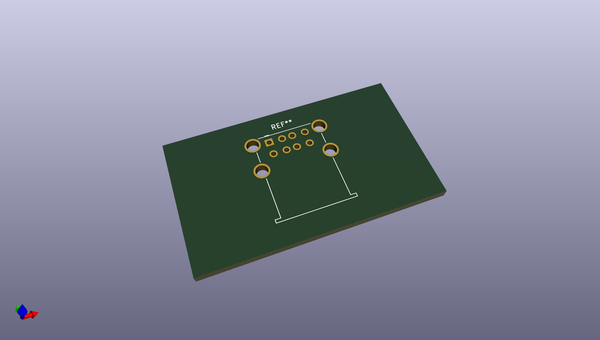
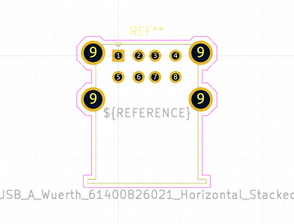

# OOMP Footprint  
## USB_A_Wuerth_61400826021_Horizontal_Stacked  by none  
  
oomp key: oomp_kicad_connector_usb_usb_a_wuerth_61400826021_horizontal_stacked  
  
source repo at: [http://gitlab.com/kicad/libraries/kicad-footprints//blob/master/tmp/libraries/kicad-footprints/Varistor.pretty/RV_Rect_V25S440P_L26.5mm_W8.2mm_P12.7mm.kicad_mod](http://gitlab.com/kicad/libraries/kicad-footprints//blob/master/tmp/libraries/kicad-footprints/Varistor.pretty/RV_Rect_V25S440P_L26.5mm_W8.2mm_P12.7mm.kicad_mod)  
## Footprint  
  
  
  
  
| name | value | 
| --- | --- | 
| footprint name | USB_A_Wuerth_61400826021_Horizontal_Stacked | 
| footprint description | Stacked USB A connector http://katalog.we-online.de/em/datasheet/61400826021.pdf | 
| number of pads | 12 | 
| github path | http://github.com/kicad/libraries/kicad-footprints//blob/master/tmp/libraries/kicad-footprints/Connector_USB.pretty/USB_A_Wuerth_61400826021_Horizontal_Stacked.kicad_mod | 
| oomp key | oomp_kicad_connector_usb_usb_a_wuerth_61400826021_horizontal_stacked | 
| oomp bot github | https://github.com/oomlout/oomlout_oomp_footprint_bot/tree/main/footprints/kicad_connector_usb_usb_a_wuerth_61400826021_horizontal_stacked/working | 
## Images  
