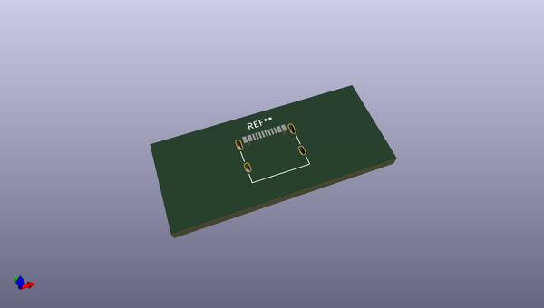
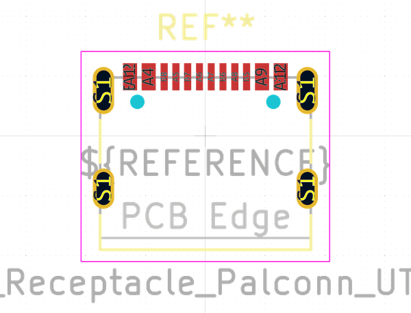

# OOMP Footprint  
## USB_C_Receptacle_Palconn_UTC16-G  by none  
  
oomp key: oomp_kicad_connector_usb_usb_c_receptacle_palconn_utc16_g  
  
source repo at: [http://gitlab.com/kicad/libraries/kicad-footprints//blob/master/tmp/libraries/kicad-footprints/Varistor.pretty/RV_Rect_V25S440P_L26.5mm_W8.2mm_P12.7mm.kicad_mod](http://gitlab.com/kicad/libraries/kicad-footprints//blob/master/tmp/libraries/kicad-footprints/Varistor.pretty/RV_Rect_V25S440P_L26.5mm_W8.2mm_P12.7mm.kicad_mod)  
## Footprint  
  
  
  
  
| name | value | 
| --- | --- | 
| footprint name | USB_C_Receptacle_Palconn_UTC16-G | 
| footprint description | http://www.palpilot.com/wp-content/uploads/2017/05/UTC027-GKN-OR-Rev-A.pdf | 
| number of pads | 22 | 
| github path | http://github.com/kicad/libraries/kicad-footprints//blob/master/tmp/libraries/kicad-footprints/Connector_USB.pretty/USB_C_Receptacle_Palconn_UTC16-G.kicad_mod | 
| oomp key | oomp_kicad_connector_usb_usb_c_receptacle_palconn_utc16_g | 
| oomp bot github | https://github.com/oomlout/oomlout_oomp_footprint_bot/tree/main/footprints/kicad_connector_usb_usb_c_receptacle_palconn_utc16_g/working | 
## Images  
