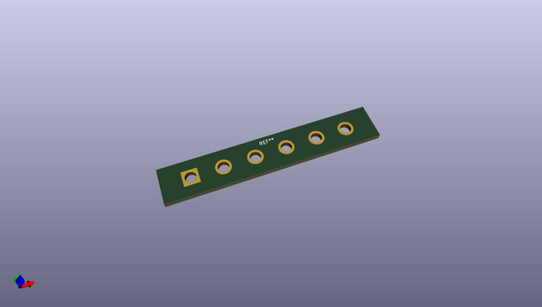
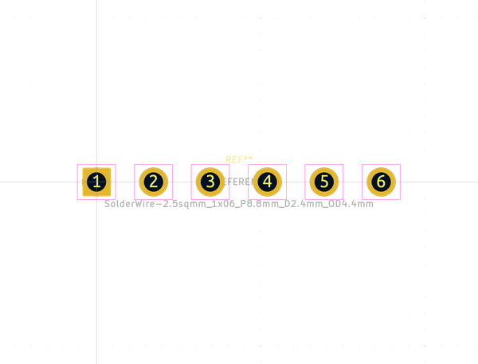

# OOMP Footprint  
## SolderWire-2.5sqmm_1x06_P8.8mm_D2.4mm_OD4.4mm  by none  
  
oomp key: oomp_kicad_connector_wire_solderwire_2_5sqmm_1x06_p8_8mm_d2_4mm_od4_4mm  
  
source repo at: [http://gitlab.com/kicad/libraries/kicad-footprints//blob/master/tmp/libraries/kicad-footprints/Varistor.pretty/RV_Rect_V25S440P_L26.5mm_W8.2mm_P12.7mm.kicad_mod](http://gitlab.com/kicad/libraries/kicad-footprints//blob/master/tmp/libraries/kicad-footprints/Varistor.pretty/RV_Rect_V25S440P_L26.5mm_W8.2mm_P12.7mm.kicad_mod)  
## Footprint  
  
  
  
  
| name | value | 
| --- | --- | 
| footprint name | SolderWire-2.5sqmm_1x06_P8.8mm_D2.4mm_OD4.4mm | 
| footprint description | Soldered wire connection, for 6 times 2.5 mm² wires, reinforced insulation, conductor diameter 2.4mm, outer diameter 4.4mm, size source Multi-Contact FLEXI-xV 2.5 (https://ec.staubli.com/AcroFiles/Catalogues/TM_Cab-Main-11014119_(en)_hi.pdf), bend radius 3 times outer diameter, generated with kicad-footprint-generator | 
| number of pads | 6 | 
| github path | http://github.com/kicad/libraries/kicad-footprints//blob/master/tmp/libraries/kicad-footprints/Connector_Wire.pretty/SolderWire-2.5sqmm_1x06_P8.8mm_D2.4mm_OD4.4mm.kicad_mod | 
| oomp key | oomp_kicad_connector_wire_solderwire_2_5sqmm_1x06_p8_8mm_d2_4mm_od4_4mm | 
| oomp bot github | https://github.com/oomlout/oomlout_oomp_footprint_bot/tree/main/footprints/kicad_connector_wire_solderwire_2_5sqmm_1x06_p8_8mm_d2_4mm_od4_4mm/working | 
## Images  
