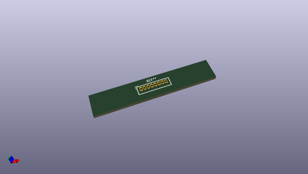
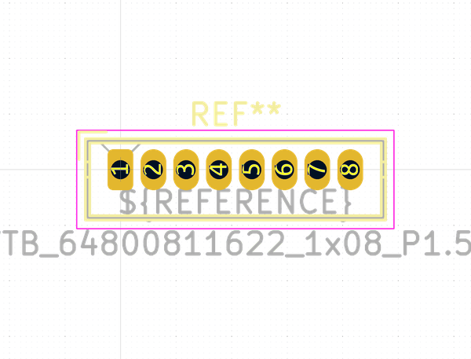

# OOMP Footprint  
## Wuerth_WR-WTB_64800811622_1x08_P1.50mm_Vertical  by none  
  
oomp key: oomp_kicad_connector_wuerth_wuerth_wr_wtb_64800811622_1x08_p1_50mm_vertical  
  
source repo at: [http://gitlab.com/kicad/libraries/kicad-footprints//blob/master/tmp/libraries/kicad-footprints/Varistor.pretty/RV_Rect_V25S440P_L26.5mm_W8.2mm_P12.7mm.kicad_mod](http://gitlab.com/kicad/libraries/kicad-footprints//blob/master/tmp/libraries/kicad-footprints/Varistor.pretty/RV_Rect_V25S440P_L26.5mm_W8.2mm_P12.7mm.kicad_mod)  
## Footprint  
  
  
  
  
| name | value | 
| --- | --- | 
| footprint name | Wuerth_WR-WTB_64800811622_1x08_P1.50mm_Vertical | 
| footprint description | Wuerth WR-WTB series connector, 64800811622 (https://katalog.we-online.com/em/datasheet/6480xx11622.pdf), generated with kicad-footprint-generator | 
| number of pads | 8 | 
| github path | http://github.com/kicad/libraries/kicad-footprints//blob/master/tmp/libraries/kicad-footprints/Connector_Wuerth.pretty/Wuerth_WR-WTB_64800811622_1x08_P1.50mm_Vertical.kicad_mod | 
| oomp key | oomp_kicad_connector_wuerth_wuerth_wr_wtb_64800811622_1x08_p1_50mm_vertical | 
| oomp bot github | https://github.com/oomlout/oomlout_oomp_footprint_bot/tree/main/footprints/kicad_connector_wuerth_wuerth_wr_wtb_64800811622_1x08_p1_50mm_vertical/working | 
## Images  
