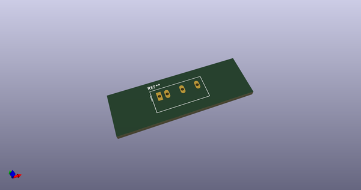
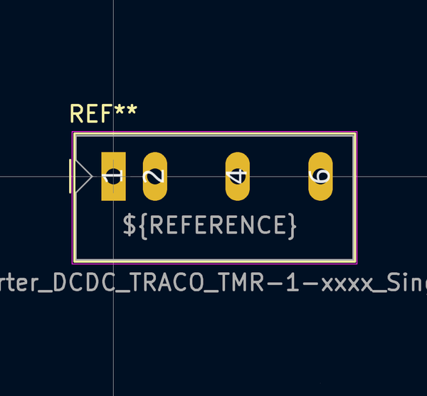

# OOMP Footprint  
## Converter_DCDC_TRACO_TMR-1-xxxx_Single_THT  by none  
  
oomp key: oomp_kicad_converter_dcdc_converter_dcdc_traco_tmr_1_xxxx_single_tht  
  
source repo at: [http://gitlab.com/kicad/libraries/kicad-footprints//blob/master/tmp/libraries/kicad-footprints/Varistor.pretty/RV_Rect_V25S440P_L26.5mm_W8.2mm_P12.7mm.kicad_mod](http://gitlab.com/kicad/libraries/kicad-footprints//blob/master/tmp/libraries/kicad-footprints/Varistor.pretty/RV_Rect_V25S440P_L26.5mm_W8.2mm_P12.7mm.kicad_mod)  
## Footprint  
  
  
  
  
| name | value | 
| --- | --- | 
| footprint name | Converter_DCDC_TRACO_TMR-1-xxxx_Single_THT | 
| footprint description | DCDC-Converter, TRACO, TMR 1-xxxx, Single output, Rev. March 21.2016 | 
| number of pads | 4 | 
| github path | http://github.com/kicad/libraries/kicad-footprints//blob/master/tmp/libraries/kicad-footprints/Converter_DCDC.pretty/Converter_DCDC_TRACO_TMR-1-xxxx_Single_THT.kicad_mod | 
| oomp key | oomp_kicad_converter_dcdc_converter_dcdc_traco_tmr_1_xxxx_single_tht | 
| oomp bot github | https://github.com/oomlout/oomlout_oomp_footprint_bot/tree/main/footprints/kicad_converter_dcdc_converter_dcdc_traco_tmr_1_xxxx_single_tht/working | 
## Images  
  
  
  
  
  
  
  
  
