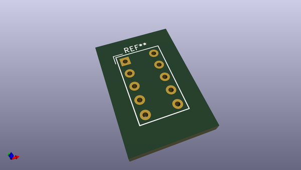
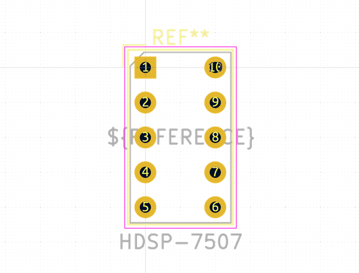

# OOMP Footprint  
## HDSP-7507  by none  
  
oomp key: oomp_kicad_display_7segment_hdsp_7507  
  
source repo at: [http://gitlab.com/kicad/libraries/kicad-footprints//blob/master/tmp/libraries/kicad-footprints/Varistor.pretty/RV_Rect_V25S440P_L26.5mm_W8.2mm_P12.7mm.kicad_mod](http://gitlab.com/kicad/libraries/kicad-footprints//blob/master/tmp/libraries/kicad-footprints/Varistor.pretty/RV_Rect_V25S440P_L26.5mm_W8.2mm_P12.7mm.kicad_mod)  
## Footprint  
  
  
  
  
| name | value | 
| --- | --- | 
| footprint name | HDSP-7507 | 
| footprint description | +-1 overflow 7 segment high efficiency red, https://docs.broadcom.com/docs/AV02-2553EN | 
| number of pads | 10 | 
| github path | http://github.com/kicad/libraries/kicad-footprints//blob/master/tmp/libraries/kicad-footprints/Display_7Segment.pretty/HDSP-7507.kicad_mod | 
| oomp key | oomp_kicad_display_7segment_hdsp_7507 | 
| oomp bot github | https://github.com/oomlout/oomlout_oomp_footprint_bot/tree/main/footprints/kicad_display_7segment_hdsp_7507/working | 
## Images  
