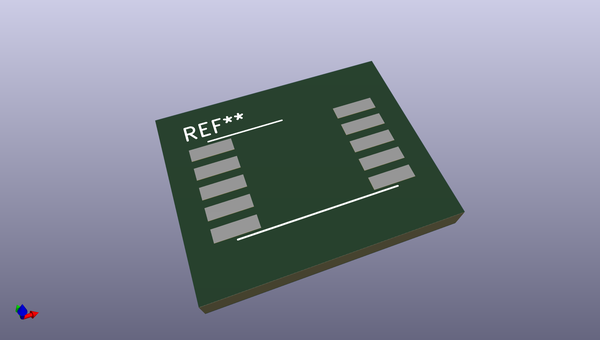
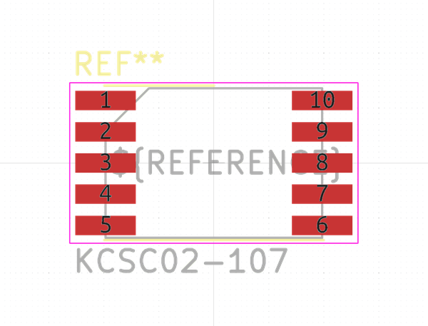

# OOMP Footprint  
## KCSC02-107  by none  
  
oomp key: oomp_kicad_display_7segment_kcsc02_107  
  
source repo at: [http://gitlab.com/kicad/libraries/kicad-footprints//blob/master/tmp/libraries/kicad-footprints/Varistor.pretty/RV_Rect_V25S440P_L26.5mm_W8.2mm_P12.7mm.kicad_mod](http://gitlab.com/kicad/libraries/kicad-footprints//blob/master/tmp/libraries/kicad-footprints/Varistor.pretty/RV_Rect_V25S440P_L26.5mm_W8.2mm_P12.7mm.kicad_mod)  
## Footprint  
  
  
  
  
| name | value | 
| --- | --- | 
| footprint name | KCSC02-107 | 
| footprint description | http://www.kingbright.com/attachments/file/psearch/000/00/00/KCSC02-107(Ver.9A).pdf | 
| number of pads | 10 | 
| github path | http://github.com/kicad/libraries/kicad-footprints//blob/master/tmp/libraries/kicad-footprints/Display_7Segment.pretty/KCSC02-107.kicad_mod | 
| oomp key | oomp_kicad_display_7segment_kcsc02_107 | 
| oomp bot github | https://github.com/oomlout/oomlout_oomp_footprint_bot/tree/main/footprints/kicad_display_7segment_kcsc02_107/working | 
## Images  
