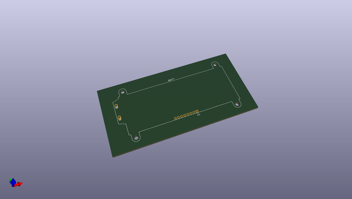
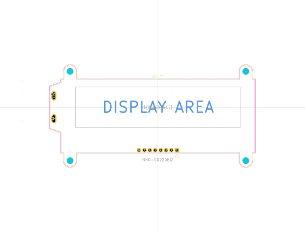

# OOMP Footprint  
## NHD-C0220BiZ  by none  
  
oomp key: oomp_kicad_display_nhd_c0220biz  
  
source repo at: [http://gitlab.com/kicad/libraries/kicad-footprints//blob/master/tmp/libraries/kicad-footprints/Varistor.pretty/RV_Rect_V25S440P_L26.5mm_W8.2mm_P12.7mm.kicad_mod](http://gitlab.com/kicad/libraries/kicad-footprints//blob/master/tmp/libraries/kicad-footprints/Varistor.pretty/RV_Rect_V25S440P_L26.5mm_W8.2mm_P12.7mm.kicad_mod)  
## Footprint  
  
  
  
  
| name | value | 
| --- | --- | 
| footprint name | NHD-C0220BiZ | 
| footprint description | NHD-C0220BiZ LCD http://www.newhavendisplay.com/specs/NHD-C0220BiZ-FSW-FBW-3V3M.pdf | 
| number of pads | 14 | 
| github path | http://github.com/kicad/libraries/kicad-footprints//blob/master/tmp/libraries/kicad-footprints/Display.pretty/NHD-C0220BiZ.kicad_mod | 
| oomp key | oomp_kicad_display_nhd_c0220biz | 
| oomp bot github | https://github.com/oomlout/oomlout_oomp_footprint_bot/tree/main/footprints/kicad_display_nhd_c0220biz/working | 
## Images  
