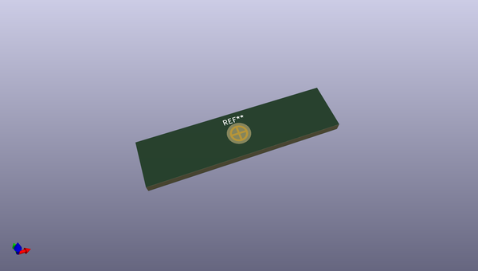

# OOMP Footprint  
## Fiducial_classic_Small_CopperTop_Type1  by none  
  
oomp key: oomp_kicad_fiducial_classic_small_coppertop_type1_fiducial_classic_small_coppertop_type1  
  
source repo at: [http://gitlab.com/kicad/libraries/kicad-footprints//blob/master/tmp/libraries/kicad-footprints/Varistor.pretty/RV_Rect_V25S440P_L26.5mm_W8.2mm_P12.7mm.kicad_mod](http://gitlab.com/kicad/libraries/kicad-footprints//blob/master/tmp/libraries/kicad-footprints/Varistor.pretty/RV_Rect_V25S440P_L26.5mm_W8.2mm_P12.7mm.kicad_mod)  
## Footprint  
  
  
  
  
| name | value | 
| --- | --- | 
| footprint name | Fiducial_classic_Small_CopperTop_Type1 | 
| footprint description | Fiducial, Classic, Small, Copper Top, Type 1 | 
| number of pads | 1 | 
| github path | http://github.com/kicad/libraries/kicad-footprints//blob/master/tmp/libraries/kicad-footprints/Obsolete/Fiducial/Fiducial_classic_Small_CopperTop_Type1.kicad_mod | 
| oomp key | oomp_kicad_fiducial_classic_small_coppertop_type1_fiducial_classic_small_coppertop_type1 | 
| oomp bot github | https://github.com/oomlout/oomlout_oomp_footprint_bot/tree/main/footprints/kicad_fiducial_classic_small_coppertop_type1_fiducial_classic_small_coppertop_type1/working | 
## Images  
