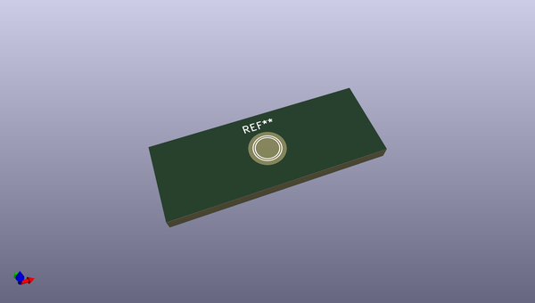

# OOMP Footprint  
## Fiducial_Modern_SilkscreenTop  by none  
  
oomp key: oomp_kicad_fiducial_modern_silkscreentop_fiducial_modern_silkscreentop  
  
source repo at: [http://gitlab.com/kicad/libraries/kicad-footprints//blob/master/tmp/libraries/kicad-footprints/Varistor.pretty/RV_Rect_V25S440P_L26.5mm_W8.2mm_P12.7mm.kicad_mod](http://gitlab.com/kicad/libraries/kicad-footprints//blob/master/tmp/libraries/kicad-footprints/Varistor.pretty/RV_Rect_V25S440P_L26.5mm_W8.2mm_P12.7mm.kicad_mod)  
## Footprint  
  
  
  
  
| name | value | 
| --- | --- | 
| footprint name | Fiducial_Modern_SilkscreenTop | 
| footprint description | Fiducial, Modern, Silkscreen Top | 
| number of pads | 1 | 
| github path | http://github.com/kicad/libraries/kicad-footprints//blob/master/tmp/libraries/kicad-footprints/Obsolete/Fiducial/Fiducial_Modern_SilkscreenTop.kicad_mod | 
| oomp key | oomp_kicad_fiducial_modern_silkscreentop_fiducial_modern_silkscreentop | 
| oomp bot github | https://github.com/oomlout/oomlout_oomp_footprint_bot/tree/main/footprints/kicad_fiducial_modern_silkscreentop_fiducial_modern_silkscreentop/working | 
## Images  
