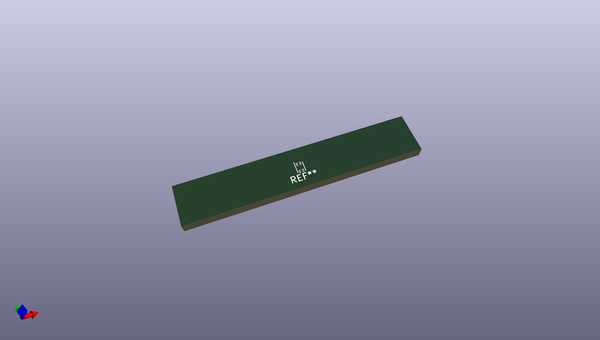
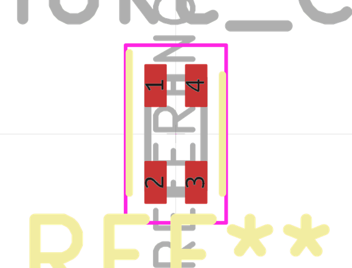

# OOMP Footprint  
## L_CommonModeChoke_Coilcraft_0603USB  by none  
  
oomp key: oomp_kicad_inductor_smd_l_commonmodechoke_coilcraft_0603usb  
  
source repo at: [http://gitlab.com/kicad/libraries/kicad-footprints//blob/master/tmp/libraries/kicad-footprints/Varistor.pretty/RV_Rect_V25S440P_L26.5mm_W8.2mm_P12.7mm.kicad_mod](http://gitlab.com/kicad/libraries/kicad-footprints//blob/master/tmp/libraries/kicad-footprints/Varistor.pretty/RV_Rect_V25S440P_L26.5mm_W8.2mm_P12.7mm.kicad_mod)  
## Footprint  
  
  
  
  
| name | value | 
| --- | --- | 
| footprint name | L_CommonModeChoke_Coilcraft_0603USB | 
| footprint description | Coilcraft 0603USB Series Common Mode Choke, https://www.coilcraft.com/pdfs/0603usb.pdf | 
| number of pads | 4 | 
| github path | http://github.com/kicad/libraries/kicad-footprints//blob/master/tmp/libraries/kicad-footprints/Inductor_SMD.pretty/L_CommonModeChoke_Coilcraft_0603USB.kicad_mod | 
| oomp key | oomp_kicad_inductor_smd_l_commonmodechoke_coilcraft_0603usb | 
| oomp bot github | https://github.com/oomlout/oomlout_oomp_footprint_bot/tree/main/footprints/kicad_inductor_smd_l_commonmodechoke_coilcraft_0603usb/working | 
## Images  
