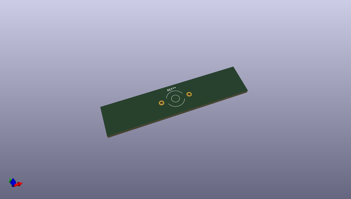
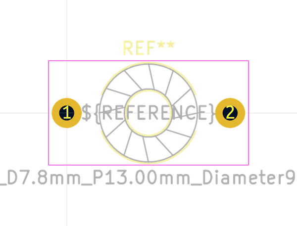

# OOMP Footprint  
## L_Toroid_Horizontal_D7.8mm_P13.00mm_Diameter9-5mm_Amidon-T30  by none  
  
oomp key: oomp_kicad_inductor_tht_l_toroid_horizontal_d7_8mm_p13_00mm_diameter9_5mm_amidon_t30  
  
source repo at: [http://gitlab.com/kicad/libraries/kicad-footprints//blob/master/tmp/libraries/kicad-footprints/Varistor.pretty/RV_Rect_V25S440P_L26.5mm_W8.2mm_P12.7mm.kicad_mod](http://gitlab.com/kicad/libraries/kicad-footprints//blob/master/tmp/libraries/kicad-footprints/Varistor.pretty/RV_Rect_V25S440P_L26.5mm_W8.2mm_P12.7mm.kicad_mod)  
## Footprint  
  
  
  
  
| name | value | 
| --- | --- | 
| footprint name | L_Toroid_Horizontal_D7.8mm_P13.00mm_Diameter9-5mm_Amidon-T30 | 
| footprint description | L_Toroid, Horizontal series, Radial, pin pitch=13.00mm, , diameter=7.7978mm, Diameter9-5mm, Amidon-T30 | 
| number of pads | 2 | 
| github path | http://github.com/kicad/libraries/kicad-footprints//blob/master/tmp/libraries/kicad-footprints/Inductor_THT.pretty/L_Toroid_Horizontal_D7.8mm_P13.00mm_Diameter9-5mm_Amidon-T30.kicad_mod | 
| oomp key | oomp_kicad_inductor_tht_l_toroid_horizontal_d7_8mm_p13_00mm_diameter9_5mm_amidon_t30 | 
| oomp bot github | https://github.com/oomlout/oomlout_oomp_footprint_bot/tree/main/footprints/kicad_inductor_tht_l_toroid_horizontal_d7_8mm_p13_00mm_diameter9_5mm_amidon_t30/working | 
## Images  
