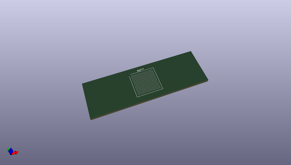
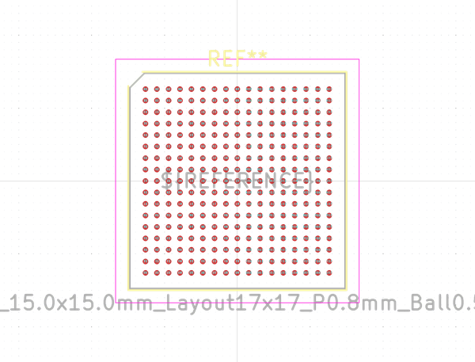

# OOMP Footprint  
##   by none  
  
oomp key: oomp_kicad_package_bga_texas_bga_289_15_0x15_0mm_layout17x17_p0_8mm_ball0_5mm_pad0_4mm  
  
source repo at: [http://gitlab.com/kicad/libraries/kicad-footprints//blob/master/tmp/libraries/kicad-footprints/Varistor.pretty/RV_Rect_V25S440P_L26.5mm_W8.2mm_P12.7mm.kicad_mod](http://gitlab.com/kicad/libraries/kicad-footprints//blob/master/tmp/libraries/kicad-footprints/Varistor.pretty/RV_Rect_V25S440P_L26.5mm_W8.2mm_P12.7mm.kicad_mod)  
## Footprint  
  
  
  
  
| name | value | 
| --- | --- | 
| footprint name |  | 
| footprint description |  | 
| number of pads |  | 
| github path | http://github.com/kicad/libraries/kicad-footprints//blob/master/tmp/libraries/kicad-footprints/Package_BGA.pretty/Texas_BGA-289_15.0x15.0mm_Layout17x17_P0.8mm_Ball0.5mm_Pad0.4mm.kicad_mod | 
| oomp key | oomp_kicad_package_bga_texas_bga_289_15_0x15_0mm_layout17x17_p0_8mm_ball0_5mm_pad0_4mm | 
| oomp bot github | https://github.com/oomlout/oomlout_oomp_footprint_bot/tree/main/footprints/kicad_package_bga_texas_bga_289_15_0x15_0mm_layout17x17_p0_8mm_ball0_5mm_pad0_4mm/working | 
## Images  
