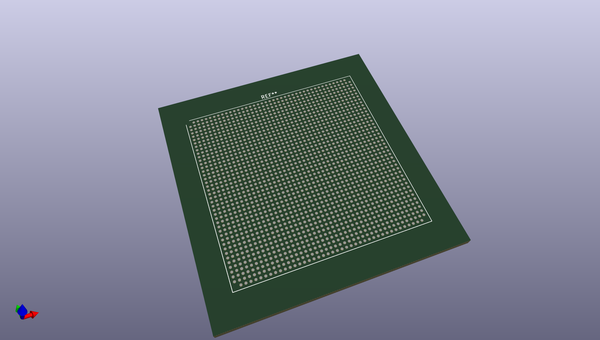
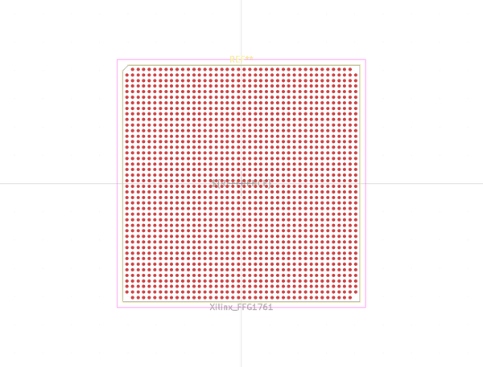

# OOMP Footprint  
## Xilinx_FFG1761  by none  
  
oomp key: oomp_kicad_package_bga_xilinx_ffg1761  
  
source repo at: [http://gitlab.com/kicad/libraries/kicad-footprints//blob/master/tmp/libraries/kicad-footprints/Varistor.pretty/RV_Rect_V25S440P_L26.5mm_W8.2mm_P12.7mm.kicad_mod](http://gitlab.com/kicad/libraries/kicad-footprints//blob/master/tmp/libraries/kicad-footprints/Varistor.pretty/RV_Rect_V25S440P_L26.5mm_W8.2mm_P12.7mm.kicad_mod)  
## Footprint  
  
  
  
  
| name | value | 
| --- | --- | 
| footprint name | Xilinx_FFG1761 | 
| footprint description | Virtex-7 BGA, 42x42 grid, 42.5x42.5mm package, 1mm pitch; https://www.xilinx.com/support/documentation/user_guides/ug475_7Series_Pkg_Pinout.pdf#page=300, NSMD pad definition Appendix A | 
| number of pads | 1760 | 
| github path | http://github.com/kicad/libraries/kicad-footprints//blob/master/tmp/libraries/kicad-footprints/Package_BGA.pretty/Xilinx_FFG1761.kicad_mod | 
| oomp key | oomp_kicad_package_bga_xilinx_ffg1761 | 
| oomp bot github | https://github.com/oomlout/oomlout_oomp_footprint_bot/tree/main/footprints/kicad_package_bga_xilinx_ffg1761/working | 
## Images  
