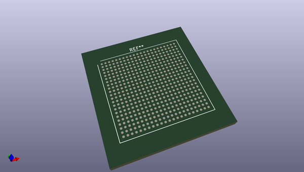
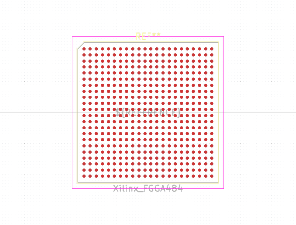

# OOMP Footprint  
## Xilinx_FGGA484  by none  
  
oomp key: oomp_kicad_package_bga_xilinx_fgga484  
  
source repo at: [http://gitlab.com/kicad/libraries/kicad-footprints//blob/master/tmp/libraries/kicad-footprints/Varistor.pretty/RV_Rect_V25S440P_L26.5mm_W8.2mm_P12.7mm.kicad_mod](http://gitlab.com/kicad/libraries/kicad-footprints//blob/master/tmp/libraries/kicad-footprints/Varistor.pretty/RV_Rect_V25S440P_L26.5mm_W8.2mm_P12.7mm.kicad_mod)  
## Footprint  
  
  
  
  
| name | value | 
| --- | --- | 
| footprint name | Xilinx_FGGA484 | 
| footprint description | Spartan-7 BGA, 22x22 grid, 23x23mm package, 1mm pitch; https://www.xilinx.com/support/documentation/user_guides/ug475_7Series_Pkg_Pinout.pdf#page=264, NSMD pad definition Appendix A | 
| number of pads | 484 | 
| github path | http://github.com/kicad/libraries/kicad-footprints//blob/master/tmp/libraries/kicad-footprints/Package_BGA.pretty/Xilinx_FGGA484.kicad_mod | 
| oomp key | oomp_kicad_package_bga_xilinx_fgga484 | 
| oomp bot github | https://github.com/oomlout/oomlout_oomp_footprint_bot/tree/main/footprints/kicad_package_bga_xilinx_fgga484/working | 
## Images  
