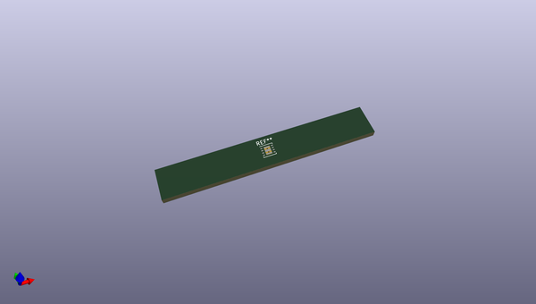
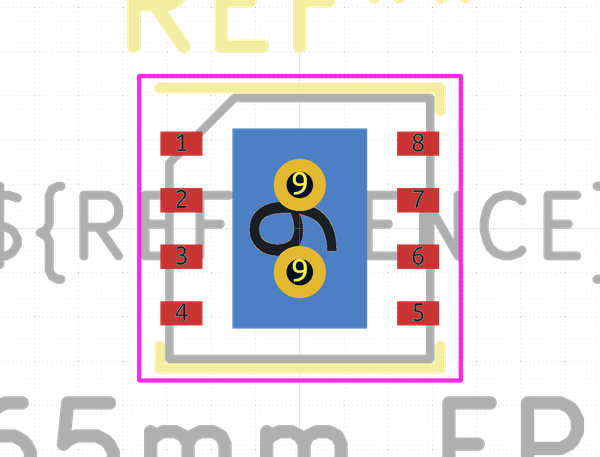

# OOMP Footprint  
## MLF-8-1EP_3x3mm_P0.65mm_EP1.55x2.3mm_ThermalVias  by none  
  
oomp key: oomp_kicad_package_dfn_qfn_mlf_8_1ep_3x3mm_p0_65mm_ep1_55x2_3mm_thermalvias  
  
source repo at: [http://gitlab.com/kicad/libraries/kicad-footprints//blob/master/tmp/libraries/kicad-footprints/Varistor.pretty/RV_Rect_V25S440P_L26.5mm_W8.2mm_P12.7mm.kicad_mod](http://gitlab.com/kicad/libraries/kicad-footprints//blob/master/tmp/libraries/kicad-footprints/Varistor.pretty/RV_Rect_V25S440P_L26.5mm_W8.2mm_P12.7mm.kicad_mod)  
## Footprint  
  
  
  
  
| name | value | 
| --- | --- | 
| footprint name | MLF-8-1EP_3x3mm_P0.65mm_EP1.55x2.3mm_ThermalVias | 
| footprint description | 8-Pin ePad 3mm x 3mm MLF - 3x3x0.85 mm Body (see Microchip datasheet http://ww1.microchip.com/downloads/en/DeviceDoc/mic5355_6.pdf) | 
| number of pads | 15 | 
| github path | http://github.com/kicad/libraries/kicad-footprints//blob/master/tmp/libraries/kicad-footprints/Package_DFN_QFN.pretty/MLF-8-1EP_3x3mm_P0.65mm_EP1.55x2.3mm_ThermalVias.kicad_mod | 
| oomp key | oomp_kicad_package_dfn_qfn_mlf_8_1ep_3x3mm_p0_65mm_ep1_55x2_3mm_thermalvias | 
| oomp bot github | https://github.com/oomlout/oomlout_oomp_footprint_bot/tree/main/footprints/kicad_package_dfn_qfn_mlf_8_1ep_3x3mm_p0_65mm_ep1_55x2_3mm_thermalvias/working | 
## Images  
