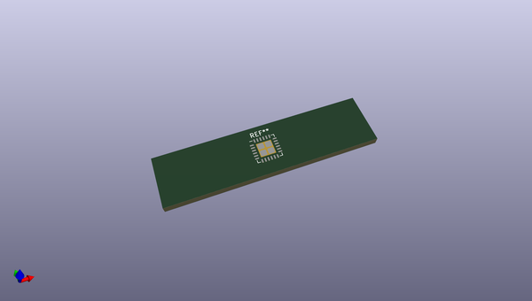
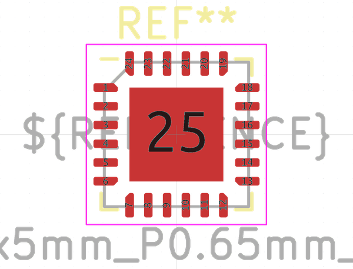

# OOMP Footprint  
## QFN-24-1EP_5x5mm_P0.65mm_EP3.25x3.25mm  by none  
  
oomp key: oomp_kicad_package_dfn_qfn_qfn_24_1ep_5x5mm_p0_65mm_ep3_25x3_25mm  
  
source repo at: [http://gitlab.com/kicad/libraries/kicad-footprints//blob/master/tmp/libraries/kicad-footprints/Varistor.pretty/RV_Rect_V25S440P_L26.5mm_W8.2mm_P12.7mm.kicad_mod](http://gitlab.com/kicad/libraries/kicad-footprints//blob/master/tmp/libraries/kicad-footprints/Varistor.pretty/RV_Rect_V25S440P_L26.5mm_W8.2mm_P12.7mm.kicad_mod)  
## Footprint  
  
  
  
  
| name | value | 
| --- | --- | 
| footprint name | QFN-24-1EP_5x5mm_P0.65mm_EP3.25x3.25mm | 
| footprint description | QFN, 24 Pin (https://semtech.my.salesforce.com/sfc/p/#E0000000JelG/a/44000000MDkO/lWPNMeJClEs8Zvyu7AlDlKSyZqhYdVpQzFLVfUp.EXs), generated with kicad-footprint-generator ipc_noLead_generator.py | 
| number of pads | 29 | 
| github path | http://github.com/kicad/libraries/kicad-footprints//blob/master/tmp/libraries/kicad-footprints/Package_DFN_QFN.pretty/QFN-24-1EP_5x5mm_P0.65mm_EP3.25x3.25mm.kicad_mod | 
| oomp key | oomp_kicad_package_dfn_qfn_qfn_24_1ep_5x5mm_p0_65mm_ep3_25x3_25mm | 
| oomp bot github | https://github.com/oomlout/oomlout_oomp_footprint_bot/tree/main/footprints/kicad_package_dfn_qfn_qfn_24_1ep_5x5mm_p0_65mm_ep3_25x3_25mm/working | 
## Images  
