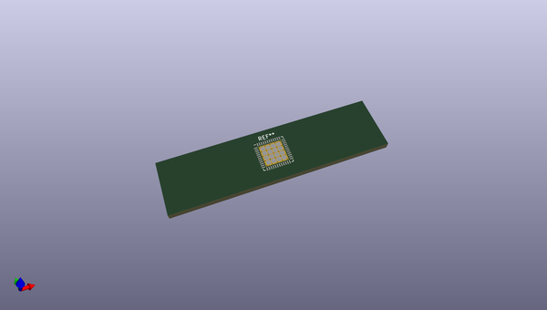
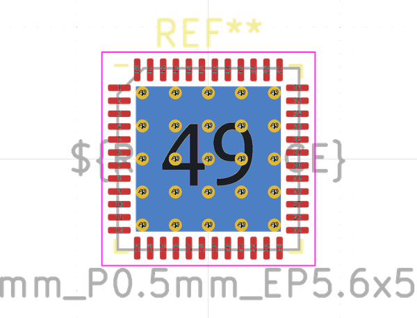

# OOMP Footprint  
## QFN-48-1EP_7x7mm_P0.5mm_EP5.6x5.6mm_ThermalVias  by none  
  
oomp key: oomp_kicad_package_dfn_qfn_qfn_48_1ep_7x7mm_p0_5mm_ep5_6x5_6mm_thermalvias  
  
source repo at: [http://gitlab.com/kicad/libraries/kicad-footprints//blob/master/tmp/libraries/kicad-footprints/Varistor.pretty/RV_Rect_V25S440P_L26.5mm_W8.2mm_P12.7mm.kicad_mod](http://gitlab.com/kicad/libraries/kicad-footprints//blob/master/tmp/libraries/kicad-footprints/Varistor.pretty/RV_Rect_V25S440P_L26.5mm_W8.2mm_P12.7mm.kicad_mod)  
## Footprint  
  
  
  
  
| name | value | 
| --- | --- | 
| footprint name | QFN-48-1EP_7x7mm_P0.5mm_EP5.6x5.6mm_ThermalVias | 
| footprint description | QFN, 48 Pin (http://www.st.com/resource/en/datasheet/stm32f042k6.pdf#page=94), generated with kicad-footprint-generator ipc_noLead_generator.py | 
| number of pads | 91 | 
| github path | http://github.com/kicad/libraries/kicad-footprints//blob/master/tmp/libraries/kicad-footprints/Package_DFN_QFN.pretty/QFN-48-1EP_7x7mm_P0.5mm_EP5.6x5.6mm_ThermalVias.kicad_mod | 
| oomp key | oomp_kicad_package_dfn_qfn_qfn_48_1ep_7x7mm_p0_5mm_ep5_6x5_6mm_thermalvias | 
| oomp bot github | https://github.com/oomlout/oomlout_oomp_footprint_bot/tree/main/footprints/kicad_package_dfn_qfn_qfn_48_1ep_7x7mm_p0_5mm_ep5_6x5_6mm_thermalvias/working | 
## Images  
