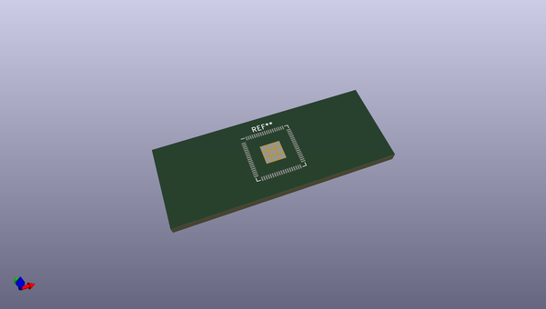
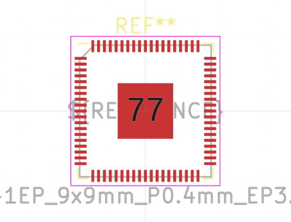

# OOMP Footprint  
## QFN-76-1EP_9x9mm_P0.4mm_EP3.8x3.8mm  by none  
  
oomp key: oomp_kicad_package_dfn_qfn_qfn_76_1ep_9x9mm_p0_4mm_ep3_8x3_8mm  
  
source repo at: [http://gitlab.com/kicad/libraries/kicad-footprints//blob/master/tmp/libraries/kicad-footprints/Varistor.pretty/RV_Rect_V25S440P_L26.5mm_W8.2mm_P12.7mm.kicad_mod](http://gitlab.com/kicad/libraries/kicad-footprints//blob/master/tmp/libraries/kicad-footprints/Varistor.pretty/RV_Rect_V25S440P_L26.5mm_W8.2mm_P12.7mm.kicad_mod)  
## Footprint  
  
  
  
  
| name | value | 
| --- | --- | 
| footprint name | QFN-76-1EP_9x9mm_P0.4mm_EP3.8x3.8mm | 
| footprint description | QFN, 76 Pin (https://www.marvell.com/documents/bqcwxsoiqfjkcjdjhkvc/#page=19), generated with kicad-footprint-generator ipc_noLead_generator.py | 
| number of pads | 86 | 
| github path | http://github.com/kicad/libraries/kicad-footprints//blob/master/tmp/libraries/kicad-footprints/Package_DFN_QFN.pretty/QFN-76-1EP_9x9mm_P0.4mm_EP3.8x3.8mm.kicad_mod | 
| oomp key | oomp_kicad_package_dfn_qfn_qfn_76_1ep_9x9mm_p0_4mm_ep3_8x3_8mm | 
| oomp bot github | https://github.com/oomlout/oomlout_oomp_footprint_bot/tree/main/footprints/kicad_package_dfn_qfn_qfn_76_1ep_9x9mm_p0_4mm_ep3_8x3_8mm/working | 
## Images  
