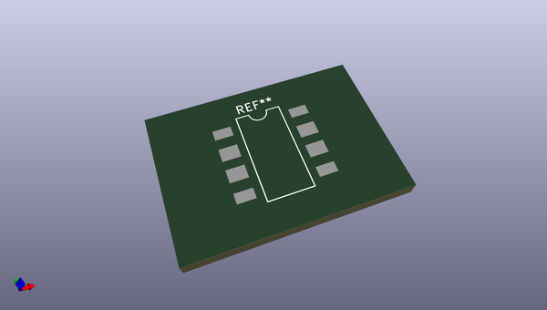
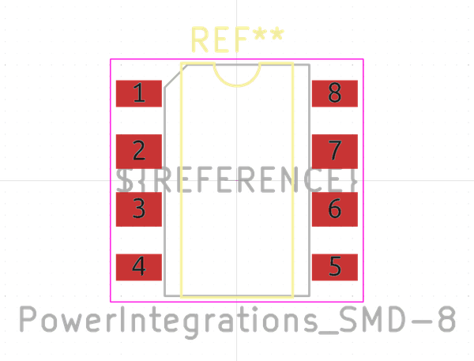

# OOMP Footprint  
## PowerIntegrations_SMD-8  by none  
  
oomp key: oomp_kicad_package_dip_powerintegrations_smd_8  
  
source repo at: [http://gitlab.com/kicad/libraries/kicad-footprints//blob/master/tmp/libraries/kicad-footprints/Varistor.pretty/RV_Rect_V25S440P_L26.5mm_W8.2mm_P12.7mm.kicad_mod](http://gitlab.com/kicad/libraries/kicad-footprints//blob/master/tmp/libraries/kicad-footprints/Varistor.pretty/RV_Rect_V25S440P_L26.5mm_W8.2mm_P12.7mm.kicad_mod)  
## Footprint  
  
  
  
  
| name | value | 
| --- | --- | 
| footprint name | PowerIntegrations_SMD-8 | 
| footprint description | PowerIntegrations variant of 8-lead surface-mounted (SMD) DIP package, row spacing 7.62 mm (300 mils), see https://www.power.com/sites/default/files/product-docs/lnk520.pdf | 
| number of pads | 8 | 
| github path | http://github.com/kicad/libraries/kicad-footprints//blob/master/tmp/libraries/kicad-footprints/Package_DIP.pretty/PowerIntegrations_SMD-8.kicad_mod | 
| oomp key | oomp_kicad_package_dip_powerintegrations_smd_8 | 
| oomp bot github | https://github.com/oomlout/oomlout_oomp_footprint_bot/tree/main/footprints/kicad_package_dip_powerintegrations_smd_8/working | 
## Images  
