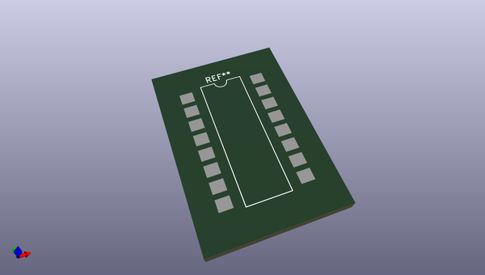
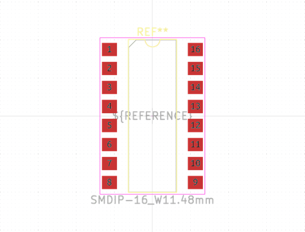

# OOMP Footprint  
## SMDIP-16_W11.48mm  by none  
  
oomp key: oomp_kicad_package_dip_smdip_16_w11_48mm  
  
source repo at: [http://gitlab.com/kicad/libraries/kicad-footprints//blob/master/tmp/libraries/kicad-footprints/Varistor.pretty/RV_Rect_V25S440P_L26.5mm_W8.2mm_P12.7mm.kicad_mod](http://gitlab.com/kicad/libraries/kicad-footprints//blob/master/tmp/libraries/kicad-footprints/Varistor.pretty/RV_Rect_V25S440P_L26.5mm_W8.2mm_P12.7mm.kicad_mod)  
## Footprint  
  
  
  
  
| name | value | 
| --- | --- | 
| footprint name | SMDIP-16_W11.48mm | 
| footprint description | 16-lead surface-mounted (SMD) DIP package, row spacing 11.48 mm (451 mils) | 
| number of pads | 16 | 
| github path | http://github.com/kicad/libraries/kicad-footprints//blob/master/tmp/libraries/kicad-footprints/Package_DIP.pretty/SMDIP-16_W11.48mm.kicad_mod | 
| oomp key | oomp_kicad_package_dip_smdip_16_w11_48mm | 
| oomp bot github | https://github.com/oomlout/oomlout_oomp_footprint_bot/tree/main/footprints/kicad_package_dip_smdip_16_w11_48mm/working | 
## Images  
