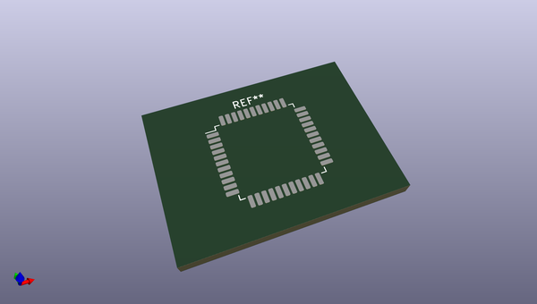
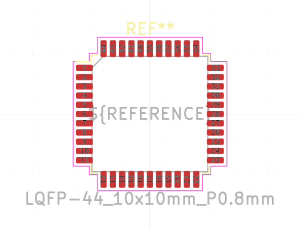

# OOMP Footprint  
## LQFP-44_10x10mm_P0.8mm  by none  
  
oomp key: oomp_kicad_package_qfp_lqfp_44_10x10mm_p0_8mm  
  
source repo at: [http://gitlab.com/kicad/libraries/kicad-footprints//blob/master/tmp/libraries/kicad-footprints/Varistor.pretty/RV_Rect_V25S440P_L26.5mm_W8.2mm_P12.7mm.kicad_mod](http://gitlab.com/kicad/libraries/kicad-footprints//blob/master/tmp/libraries/kicad-footprints/Varistor.pretty/RV_Rect_V25S440P_L26.5mm_W8.2mm_P12.7mm.kicad_mod)  
## Footprint  
  
  
  
  
| name | value | 
| --- | --- | 
| footprint name | LQFP-44_10x10mm_P0.8mm | 
| footprint description | LQFP, 44 Pin (https://www.nxp.com/files-static/shared/doc/package_info/98ASS23225W.pdf?&fsrch=1), generated with kicad-footprint-generator ipc_gullwing_generator.py | 
| number of pads | 44 | 
| github path | http://github.com/kicad/libraries/kicad-footprints//blob/master/tmp/libraries/kicad-footprints/Package_QFP.pretty/LQFP-44_10x10mm_P0.8mm.kicad_mod | 
| oomp key | oomp_kicad_package_qfp_lqfp_44_10x10mm_p0_8mm | 
| oomp bot github | https://github.com/oomlout/oomlout_oomp_footprint_bot/tree/main/footprints/kicad_package_qfp_lqfp_44_10x10mm_p0_8mm/working | 
## Images  
