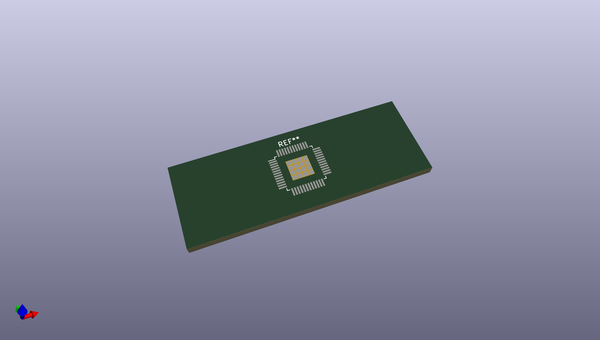
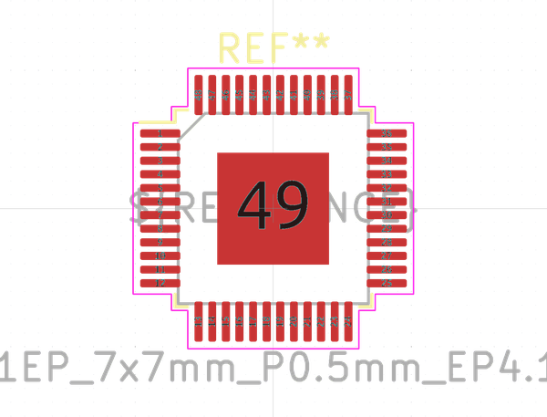

# OOMP Footprint  
## TQFP-48-1EP_7x7mm_P0.5mm_EP4.11x4.11mm  by none  
  
oomp key: oomp_kicad_package_qfp_tqfp_48_1ep_7x7mm_p0_5mm_ep4_11x4_11mm  
  
source repo at: [http://gitlab.com/kicad/libraries/kicad-footprints//blob/master/tmp/libraries/kicad-footprints/Varistor.pretty/RV_Rect_V25S440P_L26.5mm_W8.2mm_P12.7mm.kicad_mod](http://gitlab.com/kicad/libraries/kicad-footprints//blob/master/tmp/libraries/kicad-footprints/Varistor.pretty/RV_Rect_V25S440P_L26.5mm_W8.2mm_P12.7mm.kicad_mod)  
## Footprint  
  
  
  
  
| name | value | 
| --- | --- | 
| footprint name | TQFP-48-1EP_7x7mm_P0.5mm_EP4.11x4.11mm | 
| footprint description | TQFP, 48 Pin (https://www.lumissil.com/assets/pdf/core/IS31FL3236_DS.pdf), generated with kicad-footprint-generator ipc_gullwing_generator.py | 
| number of pads | 65 | 
| github path | http://github.com/kicad/libraries/kicad-footprints//blob/master/tmp/libraries/kicad-footprints/Package_QFP.pretty/TQFP-48-1EP_7x7mm_P0.5mm_EP4.11x4.11mm.kicad_mod | 
| oomp key | oomp_kicad_package_qfp_tqfp_48_1ep_7x7mm_p0_5mm_ep4_11x4_11mm | 
| oomp bot github | https://github.com/oomlout/oomlout_oomp_footprint_bot/tree/main/footprints/kicad_package_qfp_tqfp_48_1ep_7x7mm_p0_5mm_ep4_11x4_11mm/working | 
## Images  
