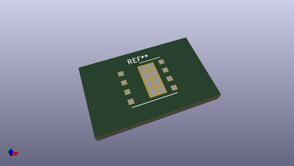
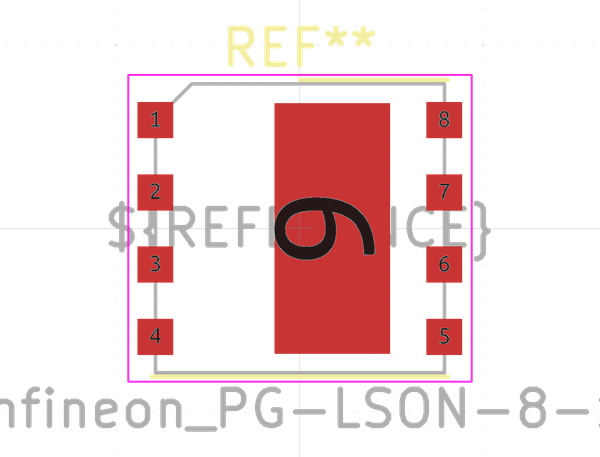

# OOMP Footprint  
## Infineon_PG-LSON-8-1  by none  
  
oomp key: oomp_kicad_package_son_infineon_pg_lson_8_1  
  
source repo at: [http://gitlab.com/kicad/libraries/kicad-footprints//blob/master/tmp/libraries/kicad-footprints/Varistor.pretty/RV_Rect_V25S440P_L26.5mm_W8.2mm_P12.7mm.kicad_mod](http://gitlab.com/kicad/libraries/kicad-footprints//blob/master/tmp/libraries/kicad-footprints/Varistor.pretty/RV_Rect_V25S440P_L26.5mm_W8.2mm_P12.7mm.kicad_mod)  
## Footprint  
  
  
  
  
| name | value | 
| --- | --- | 
| footprint name | Infineon_PG-LSON-8-1 | 
| footprint description | https://www.infineon.com/cms/en/product/packages/PG-LSON/PG-LSON-8-1/ | 
| number of pads | 17 | 
| github path | http://github.com/kicad/libraries/kicad-footprints//blob/master/tmp/libraries/kicad-footprints/Package_SON.pretty/Infineon_PG-LSON-8-1.kicad_mod | 
| oomp key | oomp_kicad_package_son_infineon_pg_lson_8_1 | 
| oomp bot github | https://github.com/oomlout/oomlout_oomp_footprint_bot/tree/main/footprints/kicad_package_son_infineon_pg_lson_8_1/working | 
## Images  
