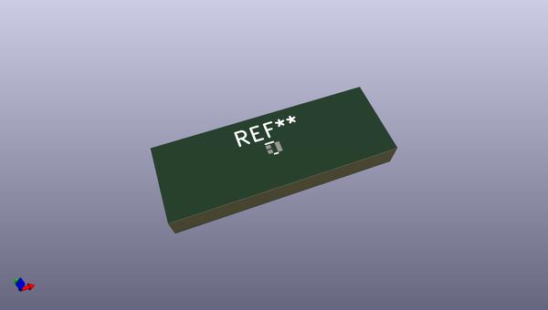
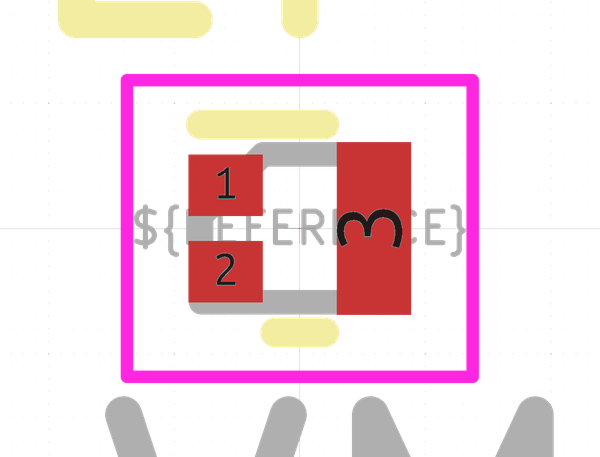

# OOMP Footprint  
## ROHM_VML0806  by none  
  
oomp key: oomp_kicad_package_son_rohm_vml0806  
  
source repo at: [http://gitlab.com/kicad/libraries/kicad-footprints//blob/master/tmp/libraries/kicad-footprints/Varistor.pretty/RV_Rect_V25S440P_L26.5mm_W8.2mm_P12.7mm.kicad_mod](http://gitlab.com/kicad/libraries/kicad-footprints//blob/master/tmp/libraries/kicad-footprints/Varistor.pretty/RV_Rect_V25S440P_L26.5mm_W8.2mm_P12.7mm.kicad_mod)  
## Footprint  
  
  
  
  
| name | value | 
| --- | --- | 
| footprint name | ROHM_VML0806 | 
| footprint description | VML0806, Rohm (http://rohmfs.rohm.com/en/techdata_basic/transistor/soldering_condition/VML0806_Soldering_Condition.pdf, http://rohmfs.rohm.com/en/products/databook/package/spec/discrete/vml0806_tr-e.pdf) | 
| number of pads | 3 | 
| github path | http://github.com/kicad/libraries/kicad-footprints//blob/master/tmp/libraries/kicad-footprints/Package_SON.pretty/ROHM_VML0806.kicad_mod | 
| oomp key | oomp_kicad_package_son_rohm_vml0806 | 
| oomp bot github | https://github.com/oomlout/oomlout_oomp_footprint_bot/tree/main/footprints/kicad_package_son_rohm_vml0806/working | 
## Images  
