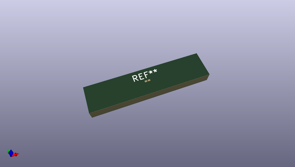
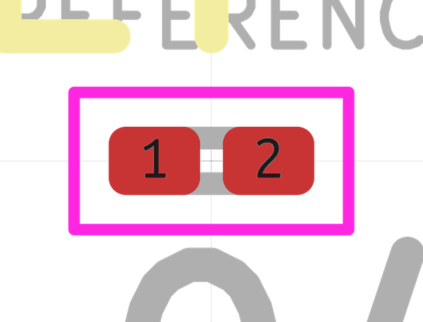

# OOMP Footprint  
## R_01005_0402Metric  by none  
  
oomp key: oomp_kicad_resistor_smd_r_01005_0402metric  
  
source repo at: [http://gitlab.com/kicad/libraries/kicad-footprints//blob/master/tmp/libraries/kicad-footprints/Varistor.pretty/RV_Rect_V25S440P_L26.5mm_W8.2mm_P12.7mm.kicad_mod](http://gitlab.com/kicad/libraries/kicad-footprints//blob/master/tmp/libraries/kicad-footprints/Varistor.pretty/RV_Rect_V25S440P_L26.5mm_W8.2mm_P12.7mm.kicad_mod)  
## Footprint  
  
  
  
  
| name | value | 
| --- | --- | 
| footprint name | R_01005_0402Metric | 
| footprint description | Resistor SMD 01005 (0402 Metric), square (rectangular) end terminal, IPC_7351 nominal, (Body size source: http://www.vishay.com/docs/20056/crcw01005e3.pdf), generated with kicad-footprint-generator | 
| number of pads | 4 | 
| github path | http://github.com/kicad/libraries/kicad-footprints//blob/master/tmp/libraries/kicad-footprints/Resistor_SMD.pretty/R_01005_0402Metric.kicad_mod | 
| oomp key | oomp_kicad_resistor_smd_r_01005_0402metric | 
| oomp bot github | https://github.com/oomlout/oomlout_oomp_footprint_bot/tree/main/footprints/kicad_resistor_smd_r_01005_0402metric/working | 
## Images  
