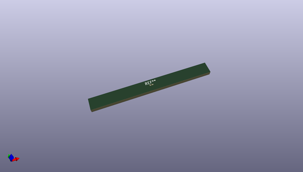

# OOMP Footprint  
## R_0201_0603Metric_Pad0.64x0.40mm_HandSolder  by none  
  
oomp key: oomp_kicad_resistor_smd_r_0201_0603metric_pad0_64x0_40mm_handsolder  
  
source repo at: [http://gitlab.com/kicad/libraries/kicad-footprints//blob/master/tmp/libraries/kicad-footprints/Varistor.pretty/RV_Rect_V25S440P_L26.5mm_W8.2mm_P12.7mm.kicad_mod](http://gitlab.com/kicad/libraries/kicad-footprints//blob/master/tmp/libraries/kicad-footprints/Varistor.pretty/RV_Rect_V25S440P_L26.5mm_W8.2mm_P12.7mm.kicad_mod)  
## Footprint  
  
  
  
  
| name | value | 
| --- | --- | 
| footprint name | R_0201_0603Metric_Pad0.64x0.40mm_HandSolder | 
| footprint description | Resistor SMD 0201 (0603 Metric), square (rectangular) end terminal, IPC_7351 nominal with elongated pad for handsoldering. (Body size source: https://www.vishay.com/docs/20052/crcw0201e3.pdf), generated with kicad-footprint-generator | 
| number of pads | 4 | 
| github path | http://github.com/kicad/libraries/kicad-footprints//blob/master/tmp/libraries/kicad-footprints/Resistor_SMD.pretty/R_0201_0603Metric_Pad0.64x0.40mm_HandSolder.kicad_mod | 
| oomp key | oomp_kicad_resistor_smd_r_0201_0603metric_pad0_64x0_40mm_handsolder | 
| oomp bot github | https://github.com/oomlout/oomlout_oomp_footprint_bot/tree/main/footprints/kicad_resistor_smd_r_0201_0603metric_pad0_64x0_40mm_handsolder/working | 
## Images  
