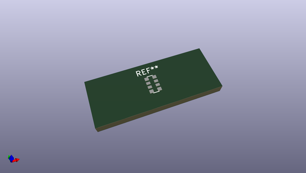
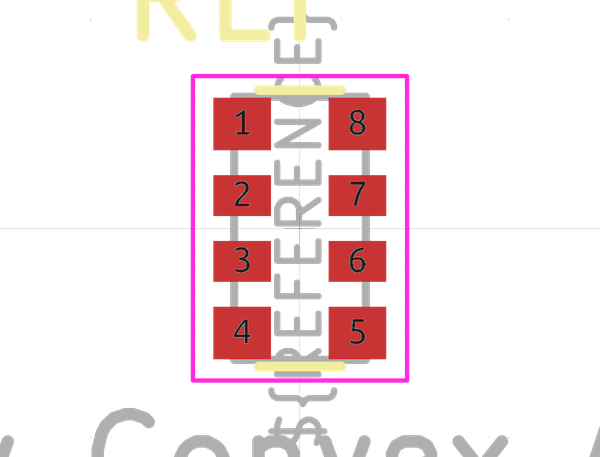

# OOMP Footprint  
## R_Array_Convex_4x0612  by none  
  
oomp key: oomp_kicad_resistor_smd_r_array_convex_4x0612  
  
source repo at: [http://gitlab.com/kicad/libraries/kicad-footprints//blob/master/tmp/libraries/kicad-footprints/Varistor.pretty/RV_Rect_V25S440P_L26.5mm_W8.2mm_P12.7mm.kicad_mod](http://gitlab.com/kicad/libraries/kicad-footprints//blob/master/tmp/libraries/kicad-footprints/Varistor.pretty/RV_Rect_V25S440P_L26.5mm_W8.2mm_P12.7mm.kicad_mod)  
## Footprint  
  
  
  
  
| name | value | 
| --- | --- | 
| footprint name | R_Array_Convex_4x0612 | 
| footprint description | Precision Thin Film Chip Resistor Array, VISHAY (see http://www.vishay.com/docs/28770/acasat.pdf) | 
| number of pads | 8 | 
| github path | http://github.com/kicad/libraries/kicad-footprints//blob/master/tmp/libraries/kicad-footprints/Resistor_SMD.pretty/R_Array_Convex_4x0612.kicad_mod | 
| oomp key | oomp_kicad_resistor_smd_r_array_convex_4x0612 | 
| oomp bot github | https://github.com/oomlout/oomlout_oomp_footprint_bot/tree/main/footprints/kicad_resistor_smd_r_array_convex_4x0612/working | 
## Images  
