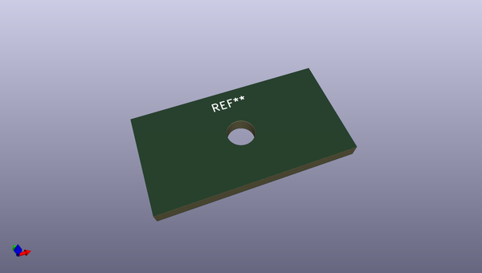

# OOMP Footprint  
## kicad_mountinghole_mountinghole_6_4mm_m6_no_courtyard  by oomlout  
  
oomp key: oomp_oomlout_oomlout_oomp_footprint_templates_kicad_mountinghole_mountinghole_6_4mm_m6_no_courtyard  
  
source repo at: [http://github.com/oomlout/oomlout_oomp_part_templates/blob/master/tmp/data/oomlout_oomp_footprint_src/oomlout_oomp_footprint_templates.pretty/oobb_connector_i2c_triple.kicad_mod](http://github.com/oomlout/oomlout_oomp_part_templates/blob/master/tmp/data/oomlout_oomp_footprint_src/oomlout_oomp_footprint_templates.pretty/oobb_connector_i2c_triple.kicad_mod)  
## Footprint  
  
  
  
  
| name | value | 
| --- | --- | 
| footprint name | kicad_mountinghole_mountinghole_6_4mm_m6_no_courtyard | 
| footprint description | Mounting Hole 6.4mm, no annular, M6 | 
| number of pads | 1 | 
| github path | http://github.com/oomlout/oomlout_oomp_part_templates/blob/master/tmp/data/oomlout_oomp_footprint_src/oomlout_oomp_footprint_templates.pretty/kicad_mountinghole_mountinghole_6_4mm_m6_no_courtyard.kicad_mod | 
| oomp key | oomp_oomlout_oomlout_oomp_footprint_templates_kicad_mountinghole_mountinghole_6_4mm_m6_no_courtyard | 
| oomp bot github | https://github.com/oomlout/oomlout_oomp_footprint_bot/tree/main/tmp/data/oomlout_oomp_footprint_src/footprints/oomlout_oomlout_oomp_footprint_templates_kicad_mountinghole_mountinghole_6_4mm_m6_no_courtyard/working | 
## Images  
