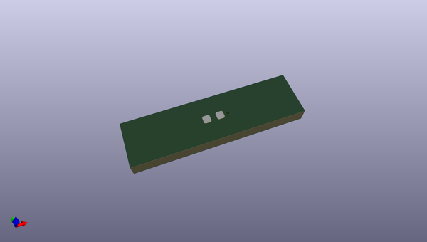

# OOMP Footprint  
## l6r_electronic_led_0603_red_no_silk_via  by oomlout  
  
oomp key: oomp_oomlout_oomlout_oomp_footprint_templates_l6r_electronic_led_0603_red_no_silk_via  
  
source repo at: [http://github.com/oomlout/oomlout_oomp_part_templates/blob/master/tmp/data/oomlout_oomp_footprint_src/oomlout_oomp_footprint_templates.pretty/oobb_connector_i2c_triple.kicad_mod](http://github.com/oomlout/oomlout_oomp_part_templates/blob/master/tmp/data/oomlout_oomp_footprint_src/oomlout_oomp_footprint_templates.pretty/oobb_connector_i2c_triple.kicad_mod)  
## Footprint  
  
  
  
  
| name | value | 
| --- | --- | 
| footprint name | l6r_electronic_led_0603_red_no_silk_via | 
| footprint description | LED SMD 0603 (1608 Metric), square (rectangular) end terminal, IPC_7351 nominal, (Body size source: http://www.tortai-tech.com/upload/download/2011102023233369053.pdf), generated with kicad-footprint-generator | 
| number of pads | 3 | 
| github path | http://github.com/oomlout/oomlout_oomp_part_templates/blob/master/tmp/data/oomlout_oomp_footprint_src/oomlout_oomp_footprint_templates.pretty/l6r_electronic_led_0603_red_no_silk_via.kicad_mod | 
| oomp key | oomp_oomlout_oomlout_oomp_footprint_templates_l6r_electronic_led_0603_red_no_silk_via | 
| oomp bot github | https://github.com/oomlout/oomlout_oomp_footprint_bot/tree/main/tmp/data/oomlout_oomp_footprint_src/footprints/oomlout_oomlout_oomp_footprint_templates_l6r_electronic_led_0603_red_no_silk_via/working | 
## Images  
